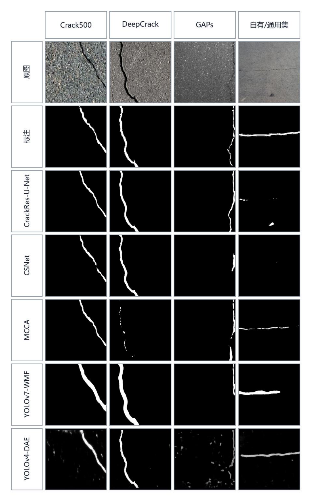
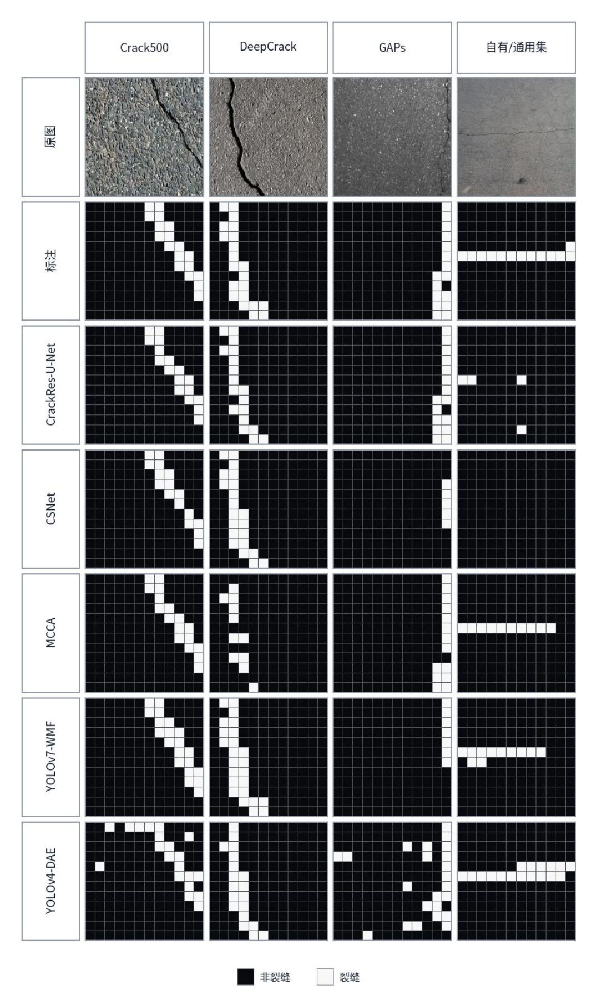
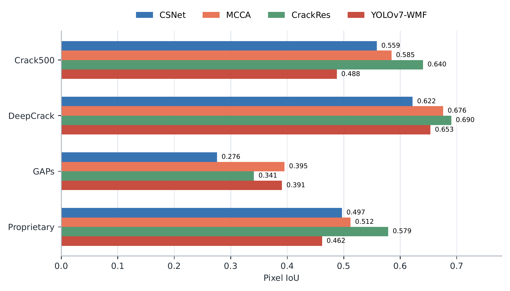
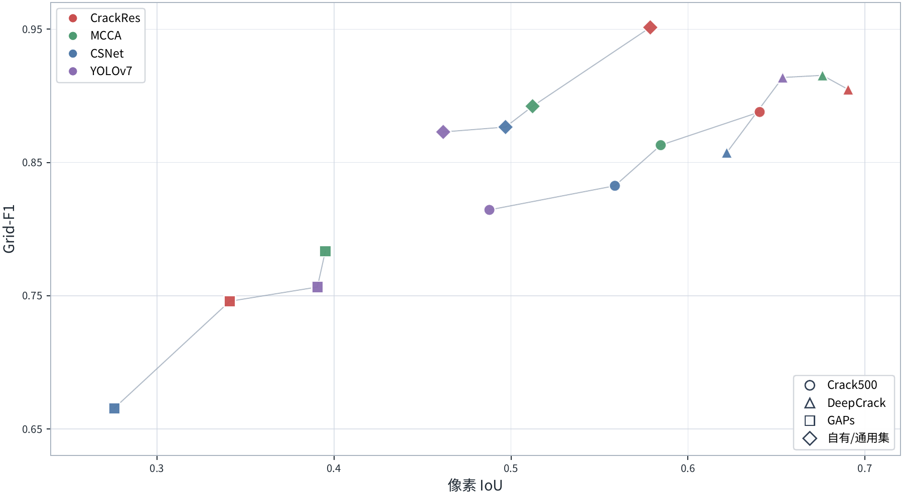
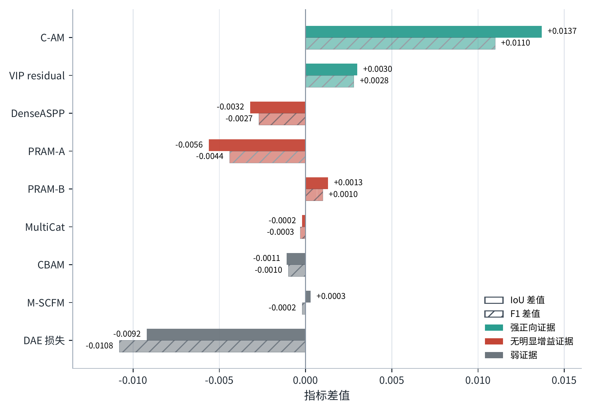

# CrackZoo

路面裂缝检测与分割模型的统一复现与评测。

本项目整理自本科毕业设计《路面裂缝检测与分割模型统一复现评测与结构归因研究》，包含 CSNet、MCCA、CrackResU-Net、YOLOv7-WMF 和 YOLOv4-DAE 五类模型的实现、训练配置与评估工具。

毕业设计比较了这些模型在不同数据集上的表现，并通过消融实验分析注意力和特征融合模块的作用。评估时将各模型输出转为二值裂缝掩膜，同时观察像素分割质量、局部区域检出率和推理效率。

[毕业论文（PDF）](docs/paper/thesis.pdf) · [论文说明](docs/paper/README.md)

## 模型与代码来源

| 模型与论文 | 实现来源 | 本项目中的内容 |
| --- | --- | --- |
| [CSNet](https://doi.org/10.1016/j.autcon.2024.105482) | 基于 [VainF/DeepLabV3Plus-Pytorch](https://github.com/VainF/DeepLabV3Plus-Pytorch) 修改 | [csnet/](csnet/README.md)：MobileNetV2 风格编码器、DenseASPP、低层特征融合与注意力解码器 |
| [MCCA](https://doi.org/10.1016/j.engappai.2023.107328) | 作者根据论文自行实现 | [MCCA/](MCCA/README.md)：多尺度上下文模块 M-SCFM、跨层注意力 C-AM、深监督及对应消融 |
| [CrackResU-Net](https://doi.org/10.1111/mice.13128) | 作者根据论文自行实现 | [CrackResU-Net/](CrackResU-Net/README.md)：ResNet34 编码器、BAM、SA/PRAM 与辅助监督，包含六种结构变体 |
| [YOLOv7-WMF](https://doi.org/10.1016/j.autcon.2024.105331) | 基于 [WongKinYiu/yolov7](https://github.com/WongKinYiu/yolov7) 修改 | [yolov7-WMF/](yolov7-WMF/README.md)：Mycontact、VIP、MultiCat 特征融合模块，以及用于统一评估的语义分割输出头 |
| [YOLOv4-DAE](https://doi.org/10.1016/j.autcon.2023.104840) | 基于 [WongKinYiu/PyTorch_YOLOv4](https://github.com/WongKinYiu/PyTorch_YOLOv4) 修改 | [YOLOv4_DAE/](YOLOv4_DAE/README.md)：基础检测器生成粗掩膜，再由去噪自编码器修正 |

MCCA 和 CrackResU-Net 的 ResNet 主干使用 torchvision，其余网络结构由作者根据论文实现。各模型的论文和实现差异见 [参考文献](docs/REFERENCES.md)，引用条目见 [BibTeX](docs/references.bib)。

## 实验结果

以下图表取自毕业论文第五章，保留原图内容。各图对应的实验设置、来源和展示许可记录见 [图表说明](docs/FIGURES.md)。

### 像素分割与网格检出

<table>
  <tr>
    <th width="50%">图 5.1 · 模型推理可视化</th>
    <th width="50%">图 5.6 · 网格级可视化</th>
  </tr>
  <tr>
    <td valign="top"><a href="docs/assets/pixel-predictions.png"></a></td>
    <td valign="top"><a href="docs/assets/grid-predictions.png"></a></td>
  </tr>
</table>

两张图使用同一组样例。左图对照原图、标注与各模型的预测掩膜，观察裂缝的连续性、宽度及漏检；右图将掩膜映射到局部网格，观察哪些区域检出了裂缝。样例来自混合总数据集，用于展示输出形式与局部差异。

### 不同数据集上的表现



在各数据集分别训练和测试时，模型的相对表现并不一致。CrackResU-Net 在 Crack500、DeepCrack 和自有／通用集上取得较高的像素 IoU，MCCA 在 GAPs 上表现更好。论文进一步通过跨域测试考察这种差异与数据来源的关系。

### 像素精度与区域检出



像素 IoU 衡量预测掩膜与标注的重合程度，Grid-F1 衡量局部网格内是否检出裂缝。DeepCrack 上，像素 IoU 较高的模型并不同时取得最高的 Grid-F1。因此，精细分割与区域筛查需要关注不同的评价指标。

### 模块消融



C-AM 和 VIP 在对应实验中提高了指标；DenseASPP、全 PRAM 配置和 MultiCat 的收益则不明显。柱子表示同一模型增减模块后的差值，不能直接用于比较不同模型。混合集的训练与评估设置见 [评估协议](docs/EXPERIMENT_PROTOCOL.md)。

## 使用

环境配置、训练与检查点评估见 [运行说明](docs/REPRODUCING.md)。模型代码按原工程目录保留，共用的命令入口和掩膜指标放在 `scripts/` 与 `crackzoo/`。

```text
CrackZoo/
├── csnet/                 # CSNet
├── MCCA/                  # MCCA
├── CrackResU-Net/          # CrackResU-Net
├── yolov7-WMF/             # YOLOv7-WMF
├── YOLOv4_DAE/             # YOLOv4-DAE
├── crackzoo/               # 模型注册、命令调度与统一指标
├── scripts/               # 训练入口、数据检查与评估工具
├── configs/               # 数据与实验配置
└── docs/                  # 运行说明、论文图表与参考文献
```

原始实验使用了私有数据及多个公开来源的汇总数据，仓库不提供完整数据集、独立标注或训练权重。论文示例图经作者确认可在项目中展示，底层数据仍按原来源条款获取。使用数据前请分别核对原始提供方的条款，具体来源与目录格式见 [数据说明](docs/DATASET.md)。

## 致谢与许可

作者原创代码采用 **GPL-3.0-or-later**。感谢上述论文作者以及 DeepLabV3Plus-Pytorch、YOLOv7、PyTorch_YOLOv4 的维护者。第三方代码保留各自的版权与许可，详见 [第三方代码说明](THIRD_PARTY_NOTICES.md) 和 [许可状态](LICENSE.md)；论文图表的来源另列于 [图表说明](docs/FIGURES.md)。

项目维护：Zixin Huang（黄子欣）。[作者说明](AUTHORS.md) · [论文](docs/paper/README.md)
